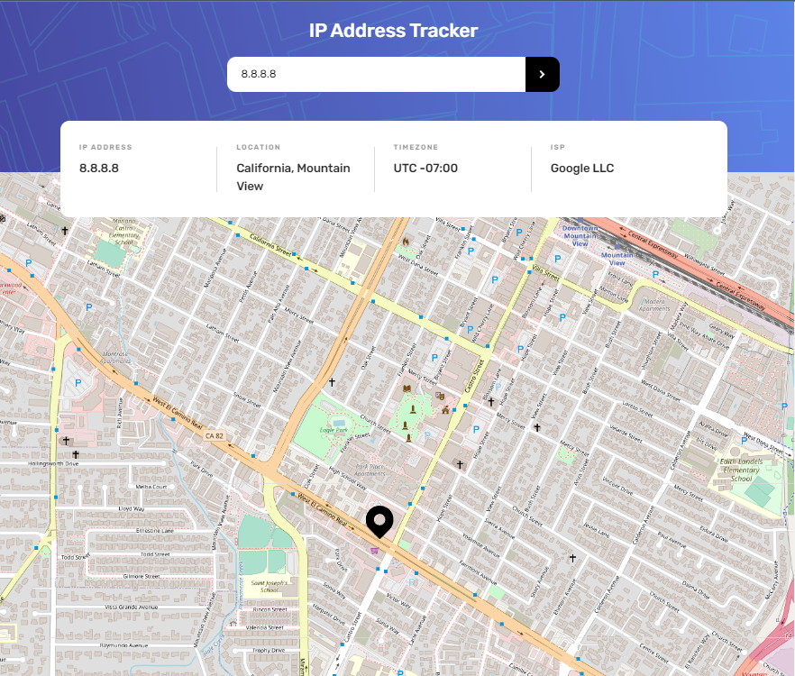
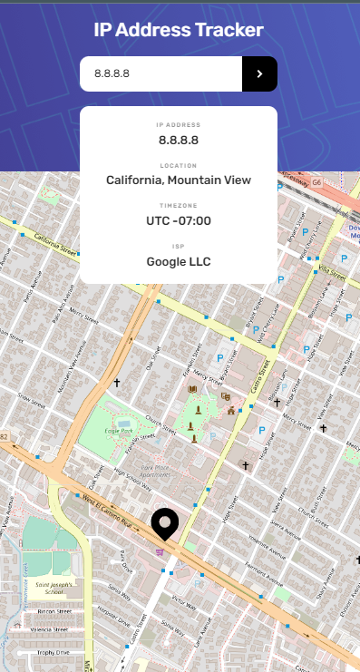

# Frontend Mentor - IP address tracker solution

This is a solution to the [IP address tracker challenge on Frontend Mentor](https://www.frontendmentor.io/challenges/ip-address-tracker-I8-0yYAH0). Frontend Mentor challenges help you improve your coding skills by building realistic projects. 

## Table of contents

- [Overview](#overview)
  - [The challenge](#the-challenge)
  - [Screenshot](#screenshot)
  - [Links](#links)
- [My process](#my-process)
  - [Built with](#built-with)
  - [What I learned](#what-i-learned)
- [Author](#author)

**Note: Delete this note and update the table of contents based on what sections you keep.**

## Overview

### The challenge

Users should be able to:

- View the optimal layout for each page depending on their device's screen size
- See hover states for all interactive elements on the page
- See their own IP address on the map on the initial page load
- Search for any IP addresses or domains and see the key information and location

### Screenshot




Add a screenshot of your solution. The easiest way to do this is to use Firefox to view your project, right-click the page and select "Take a Screenshot". You can choose either a full-height screenshot or a cropped one based on how long the page is. If it's very long, it might be best to crop it.

Alternatively, you can use a tool like [FireShot](https://getfireshot.com/) to take the screenshot. FireShot has a free option, so you don't need to purchase it. 

Then crop/optimize/edit your image however you like, add it to your project, and update the file path in the image above.

**Note: Delete this note and the paragraphs above when you add your screenshot. If you prefer not to add a screenshot, feel free to remove this entire section.**

### Links

- [Download solution](https://github.com/neo2enigma/ip-address-tracker)
- [View live demo](https://neo2enigma.github.io/ip-address-tracker/)

## My process
1- Analyzing design in the first step give us a better understanding of the design contept, elements needed and structure of the project.
2- Implementing HTML code to create a solid structure
3- implementing CSS with Mobile First View approach in a way that starts from container/block level and ends with coloring and decoration.
4- Categorizing CSS styles to make it more Object Oriented style.
5- Implementing form event handler with JavaScript.
6- Implementing GeoIP code to extract IP address, latitude and longitude, location and timezone
7- Implementing LeafletJs to convert lat/lng to a drop pin on map.
8- Implementing localStorage code to manilulate data.
9- Integrate all parts

### Built with

- Semantic HTML5 markup
- CSS custom properties
- Flexbox
- JavaScript
- Mobile-first workflow
- [IPify](https://geo.ipify.org/) - IP Geolocation API
- [LeafletJS](https://leafletjs.com/)) - JavaScript library for mobile-friendly interactive maps

**Note: These are just examples. Delete this note and replace the list above with your own choices**

### What I learned

This project create an opportunity to integrate a map rendering library to Geolocation API. It has more javaScript job to do although, CSS parts also have some nice tricks.

If you have a closer look on the design in desktop view, there is a small vertical line along information boxes which repeated 3 times. You cannot create such thing with left/right border since it is shorter that the total height of those boxes.

As you see below, I manage this by a pseudo element. One important thing is to have a padding of 32px to the right of vertical line, you have to make a 32px room from right for this pseudo. it does not work with padding of .flex-item elements.


```css
    .flex-item:not(:last-child)::after {
        position: absolute;
        content: '';
        background-color: rgba(0, 0, 0, 0.15);
        width: 1px;
        height: 75px;
        right: 32px;
        top: 6.5px;
    }
```

One important thing is, each time you request IPify, it deduces your credit. To manage this, when the user visits the page, I check if there is any record of previous request in the localStorage. If there is no record, I store it for the next time the page opens. So, request to IPify happens in to cases:
1- Search a new IP
2- User's first time visit

## Author

- Linkedin - [@kamran-safaei](https://www.linkedin.com/in/kamran-safaei/)

